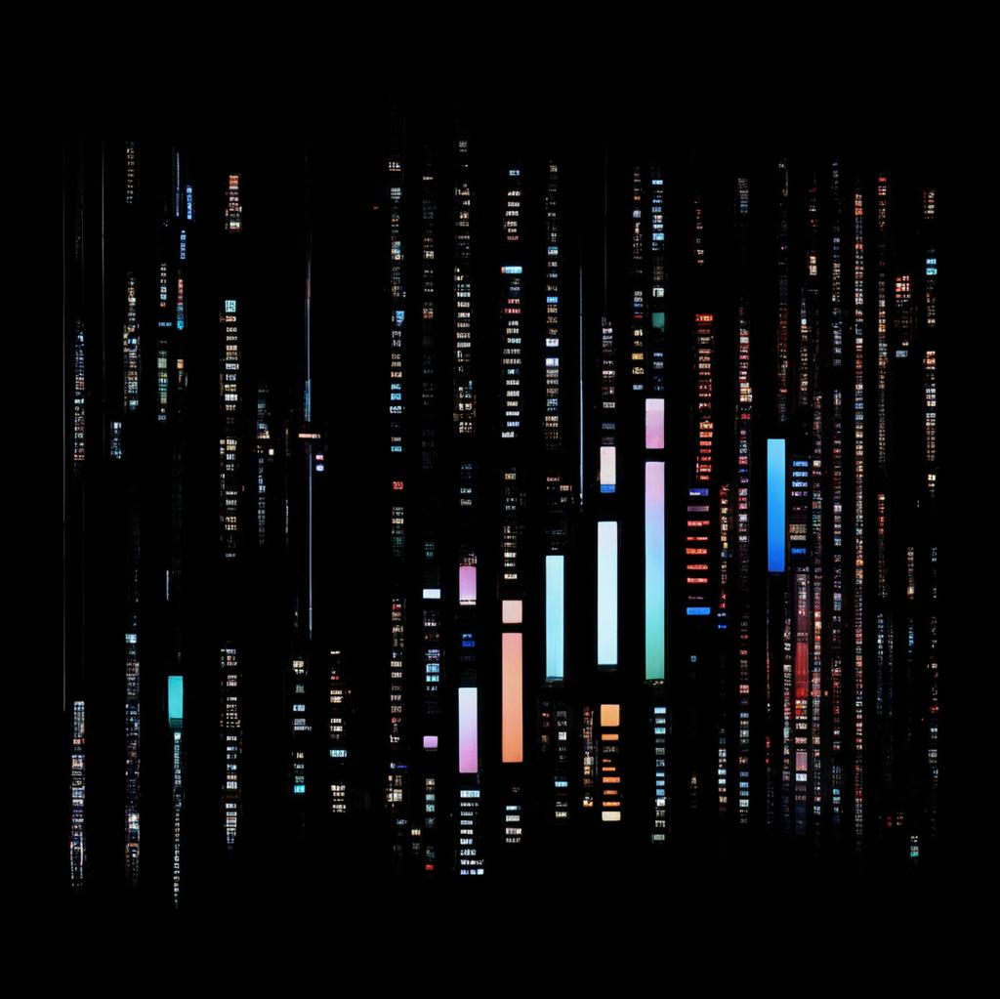

# Stream API в Java 
 
В этом модуле мы будем изучать Stream API в Java. Stream API предоставляет мощные возможности для функциональной обработки коллекций данных. 
 
## Что вы изучите 
 
В этом модуле вы изучите следующие темы: 
 
- Использование функциональных интерфейсов вместе с Stream API 
- Фильтрация, преобразование и объединение данных с использованием стримов 
- Вычисление суммы, среднего значения, нахождение наибольшего и наименьшего числа в списке 
- Проверка наличия значения в списке 
- Удаление дубликатов из списка 
- Преобразование списка элементов в список их длин 
- Соединение строк из списка в одну строку 
- Фильтрация списка чисел, оставляя только четные числа 

## Задачи 
 
В этом модуле вы также будете работать над следующими задачами: 
 
- Напишите метод, который принимает два числа от пользователя и использует функциональный интерфейс BinaryOperator для сложения этих чисел и вывода результата. 
- Напишите метод, который принимает список слов от пользователя и использует функциональный интерфейс Predicate для фильтрации слов, начинающихся с определенной буквы, и вывода отфильтрованного списка. 
- Напишите метод, который принимает список чисел от пользователя и использует функциональный интерфейс Function для преобразования каждого числа в его квадрат и вывода списка квадратов. 
- Напишите метод, который принимает список строк от пользователя и использует функциональный интерфейс Consumer для вывода каждой строки в верхнем регистре. 
- Найти сумму всех чисел в списке. 
- Найти среднее значение всех чисел в списке. 
- Найти наибольшее число в списке. 
- Найти наименьшее число в списке. 
- Проверить, содержит ли список определенное значение. 
- Удалить дубликаты из списка. 
- Преобразовать список строк в список их длин. 
- Соединить все строки из списка в одну строку. 
- Отфильтровать список чисел, оставив только четные числа. 

## Приступим! 
Удачи в изучении! 

  